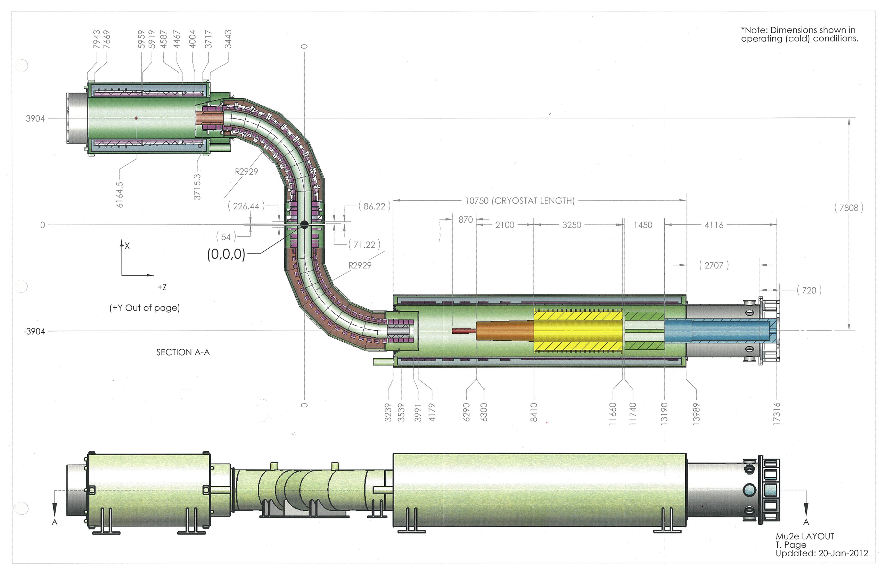

########################
Mu2E Experiment Overview
########################

The primary goal of the Mu2E experiment at Fermilab is to detect or place limits on neutrino-less
muon to electron conversions. Muons will be created from proton collisions at one end of the
experiment, then will travel through a series of electromagnets and into an aluminum target. They
will form a temporary bound state with the aluminum atoms, and then decay to an electron (and two
neutrinos). The resultant electron will spiral through a tracker in a strong magnetic field, such
that its energy and momentum will be measured with high precision. If no neutrinos are produced
during the muon decay, the electron will inherit almost all of the muon's mass-energy, which will
look slightly different than the spectrum of electron energies from regular muon decay.

Compared to previous experiments dedicated to this search, Mu2E will be ~10000x more sensitive. In
order to reach such a high sensitivity, the magnetic fields of the experiment must be known to an
extreme degree of accuracy and precision.

The goal of the Field Mapping System (FMS) is to measure the magnetic field inside of the Production
and Detection Solenoid (PS and DS), and then reconstruct a continuous magnetic field from those
measurements. The main errors in that magnetic field reconstruction should stem from the physical
limitations of the measurement devices, and not from the numeric methods that use the measurements.

The magnetic field reconstruction is done through use of a semi-analytical vector field function,
based on the solution to Laplace's equation. The function is a series expansion in terms of trig
functions and bessel functions, where the coefficients are free parameters that are determined by
fitting this function to the measured points.  Below is a proposed Mu2E Schematic from ~2012 (basic
design is still valid):

The DS starts at a Z of 3239 and extends to 13989. Muons are incident from the left, after traveling
through the two quarter toroids that make up the Transition Solenoid (TS). They strike the aluminum
target block, located at ~6000-6300, where they are captured by aluminum atoms and maintain a stable
orbit. Once they decay, the resultant electron spirals through the constant region of the detector
(from ~8000 to ~13000), leaving hits in the tracker annuli located from ~8400 to ~11660. The tracker
region must be known the most precisely, as this is the region that will be used to reconstruct the
electrons.
